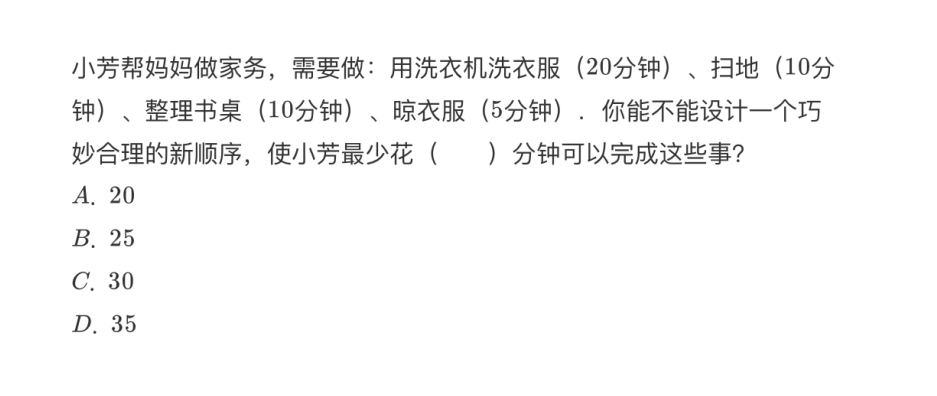
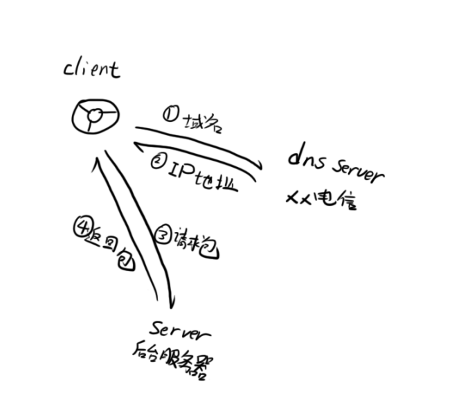
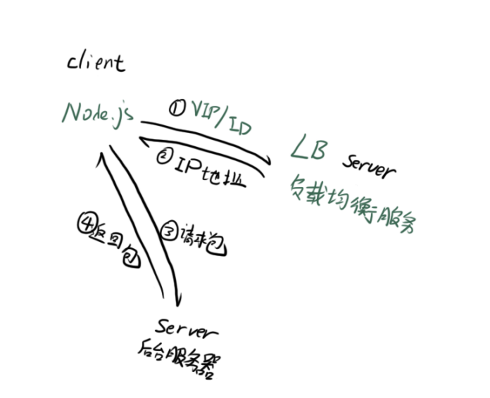
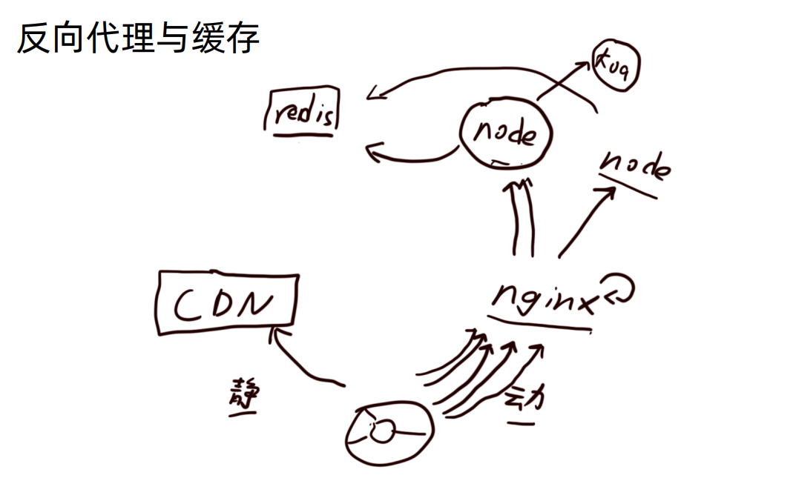

# Node.jS
> Node.js 是一个基于 Chrome V8 引擎的 JavaScript 运行时

> Node.js 使用了一个事件驱动、非阻塞式 I/O 的模型，使其轻量又高效。

在Node.js中运行javaScript代码和在Chrome中运行有什么不同吗？

几乎没有不一样。

那不一样在哪里？

- Node.js 没有浏览器 API ，即 document ，window 等。
- 加了许多 Node.js API 。

## 非阻塞I/O

- I/O 即 Input/Output，一个系统的输入和输出。 
- 阻塞 I/O 和非阻塞 I/O 的区别就在于系统接收输入再到输出期间，能不能接收其他输入

举个列子：
1. 去饭堂吃：排队打饭。
- 排队 --> 等前面的人打饭 --> 轮到你打饭 --> 吃饭
2. 出去吃：餐厅点菜。
- 坐下 --> 等待 --> 排队 --> 吃饭

## 01 异步编程 & 事件循环

- promise
- async / await
- event loop

## 02 实现http服务

- http
- SSR
- template
## 03 实现剪刀石头布小游戏

- simple example

## 04 http服务框架: Express

要了解一个框架，最好的方法是：
- 核心功能
- 解决什么问题

## 05 http服务框架: Koa

- 比Express晚了几年，有什么优势？

## 06 Buffer & stream

- 处理二进制数据
- youtube
- 更小的数据包体积
- 更快的编解码速率

## 07 RPC

- 单工通信、半双工通信、全双工通信
- 调用后端服务
- rest、Graphql
- VS Ajax

## 08 profile

- 性能检查
- 压力测试
- 性能优化

### 性能优化的几个方式
1. 减少不必要的计算
2. 防止内存泄漏
3. C++插件
4. 多进程、多线程
5. 缓存：空间换时间

## 09 process

- 多进程
- 多线程
- 进程通信
- 进程守护：心跳模型、死亡重启

## 10 nginx

- 动静分离
- 反向代理
- 负载均衡
  

## 11 other

- BFF
- serverless
- webAssembly
- electron
- next.js

## 参考文献
https://time.geekbang.org/course/intro/100036001

https://github.com/geektime-geekbang/geek-nodejs
